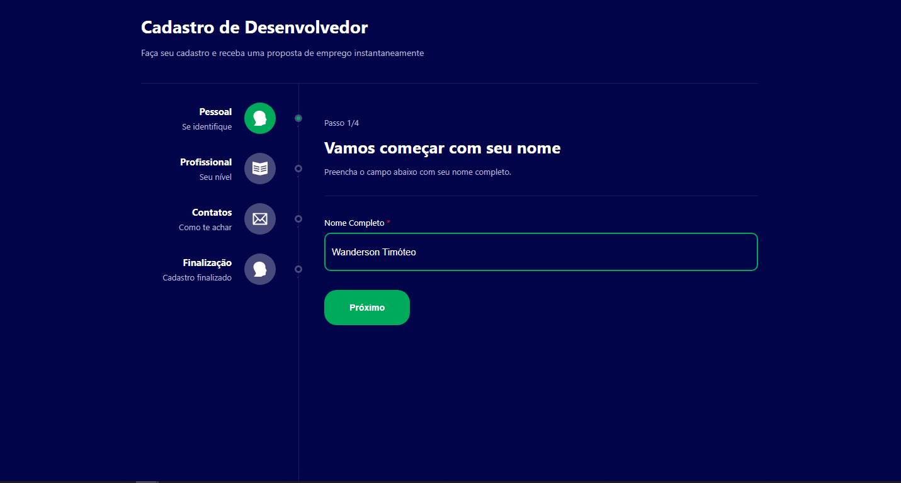
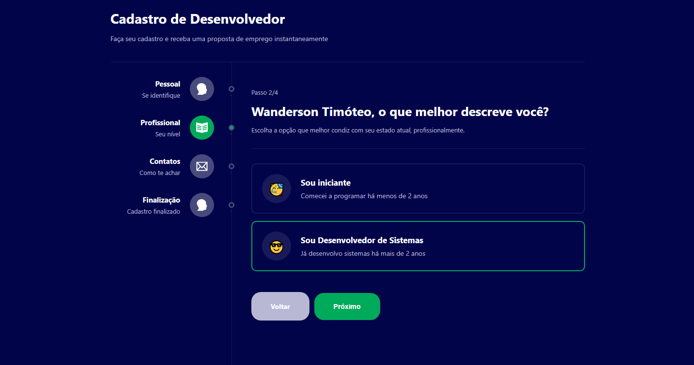
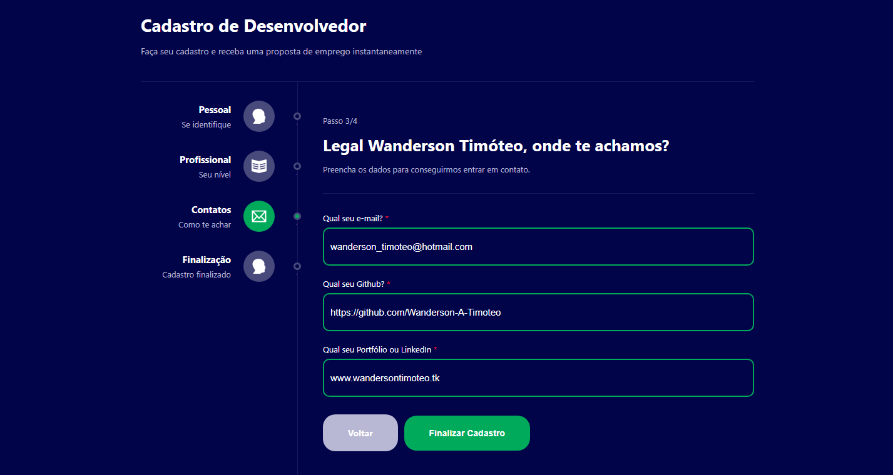
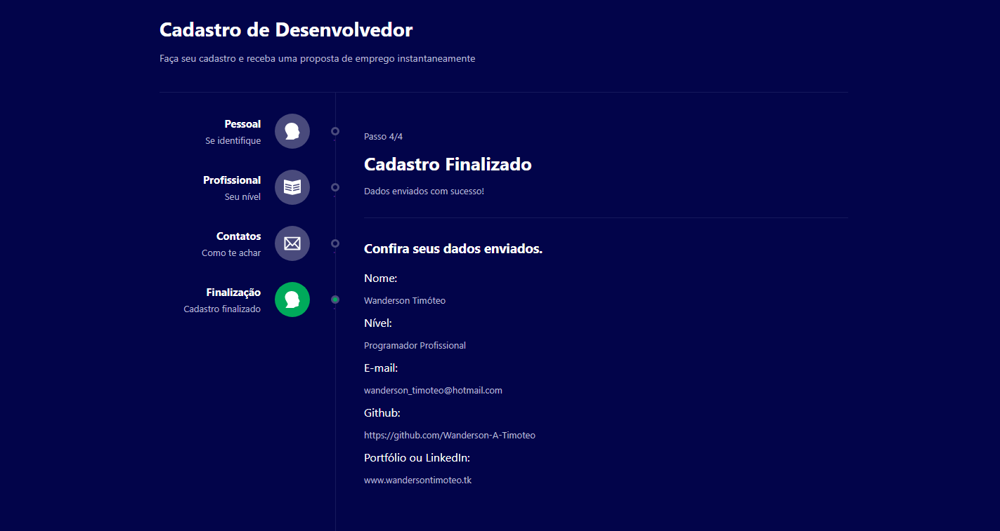
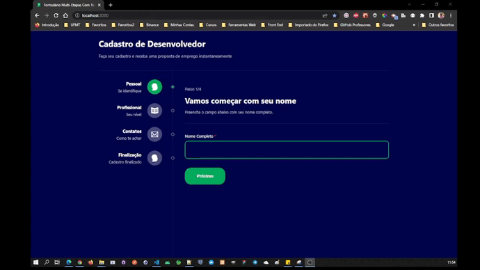

<h1 align="center">
  Formulário Multi-Etapas
</h1>

<div align="center">
  <a href="#-projeto">Projeto</a>&nbsp;&nbsp;&nbsp;|&nbsp;&nbsp;&nbsp;
  <a href="#-tecnologias">Tecnologias</a>&nbsp;&nbsp;&nbsp;|&nbsp;&nbsp;&nbsp;
  <a href="#-licença">Licença</a>&nbsp;&nbsp;&nbsp;|&nbsp;&nbsp;&nbsp;
  <a href="#-autor">Autor</a>
</div>

<br> 

<p align="center">
  
  
  
</p>

<br>

## 💻 Projeto

Este projeto consiste em um formulário de cadastro multi-etapas e com validação de campos preenchidos, neste o usuário preenche os dados solicitados e ao clicar no botão próximo o sistema renderiza na a tela do passo seguinte até a finalização. 

Durante o desenvolvimento deste projeto, pude treinar a criação de componetes, utilização de Hooks, a criação de rota para cada etapa do cadastro, foi utilizado React Router para navegar entre as telas sem recarregar a página e foi desenvolvido uma Context API para acessar os dados em qualquer página do sistema. 
<br>

### Tela Etapa 01

<p align="center">
    
</p>
<br>

### Tela Etapa 02

<p align="center">
    
</p>
<br>

### Tela Etapa 03

<p align="center">
    
</p>
<br>

### Tela de Finalização

<p align="center">
    
</p>
<br>

### Gif do Sistema Funcionando
<p align="center">
    
</p>
<br>

## 🚀 Tecnologias

Esse projeto foi desenvolvido com as seguintes tecnologias e ferramentas:

- [React](https://pt-br.reactjs.org/)
- [React Router](https://reactrouter.com/)
- [Typescript](https://www.typescriptlang.org/)
- [Styled-Components](https://styled-components.com/)

<br>

## 🔥 Executar Aplicação

### 🎇 Executando Localmente a Aplicação

Caso você deseja executar o projeto na sua máquina local, você precisará instalar o Node.js, após a instalação, basta seguir os passos abaixo:

### 🌀 Começando...

Para começar, você deve simplesmente clonar o repositório do projeto na sua máquina e instalar as dependências.

### ❗️ Instalando as Dependências (via Windows):

Abra o cmd (caso esteja utilizando o Windows) navegue até o local onde você clonou o projeto, exemplo:

```sh
C:\Users\NomeDoComputador\Documents\CloneDoProjeto
```

Quando encontrar a pasta do projeto, basta acessar a pasta `multi-step-form-with-reactjs`. Dentro desta pasta abra digite a seguinte instrução: **(dentro da pasta `multi-step-form-with-reactjs` do projeto clonado)**

```sh
npm install
```

Ao digitar a instrução acima, automaticamente ele irá baixar todas as dependências listadas e definidas no arquivo package.json:

- `node_modules` - que contêm os packages do npm que precisará para o projeto.

### 🛰️ Executando o projeto

Bom, agora que instalou as dependências **(dentro da pasta `multi-step-form-with-reactjs` do projeto clonado)** ainda no terminal cmd digite a instrução abaixo para executar o projeto:

```sh
npm start
```

Pronto! dessa forma o projeto `multi-step-form-with-reactjs` estará rodando localmente em sua maquina, acesse:

```sh
http://localhost:3000
```
<br>

## 🚩 Tenho Dúvidas... O que fazer?

Caso tenha dúvidas sobre o código do projeto, sintam-se a vontade em abrir uma **[ISSUE AQUI](https://github.com/Wanderson-A-Timoteo/multi-step-form-with-reactjs/issues)**. Assim que possível, responderei todas as dúvidas!

<br>

## 💡 Licença

Esse projeto está sob a licença MIT. Veja o arquivo [LICENSE](.github/LICENSE.md) para mais detalhes.

<br>

## 🎆 Autor

Feito com ♥ by

-  [**Wanderson A. Timóteo**](https://wandersontimoteo.tk)

<br>

## 🤝 Agradecimentos


<div align="center">
  

<h2 align="center">
  Desafio 5 Projetos em 5 Dias
</h2>
<p align="center">
  
</p>
<br>

- Projeto desenvolvido durante o `Desafio 5 Projetos em 5 Dias` com ReactJS, realizado pela plataforna de ensino [B7WEB](https://b7web.com.br/fullstack/?ref=K40921767Y&msclkid=19c576ee8ce315d5acd514754d2e3dc6).

- Agradecimento ao [Bonieky Lacerda](https://www.instagram.com/bonieky/) por compartilhar conteúdo relevante e com qualidade de ensino.
